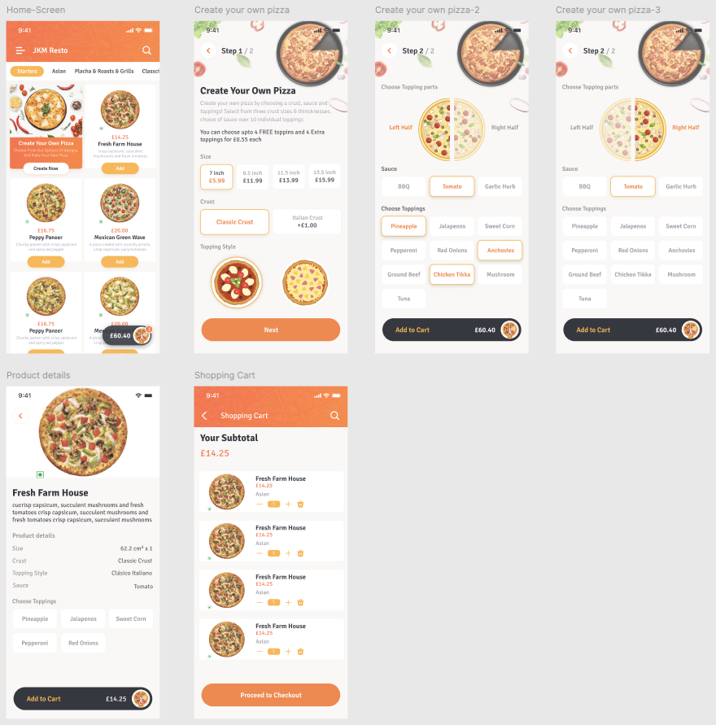
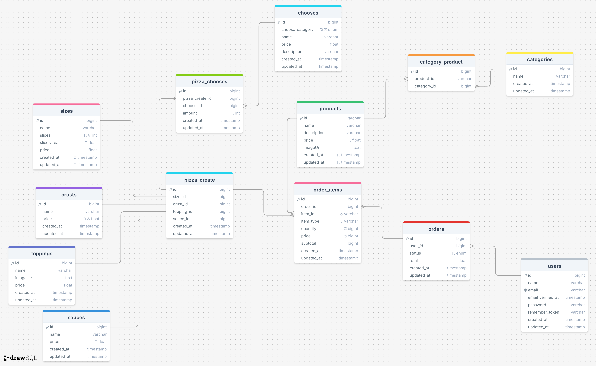

### UI



### ERM



### 🛠️ Paso a Paso de Instalación del Proyecto `pizza`

#### 1️⃣ Clona el repositorio (si aplica)

```less
git clone https://github.com/MiguelAngelPapu/pizza.git
cd pizza
```

------

### 🔙 Backend – Laravel 11

📁 Navega a la carpeta `backend`:

```less
cd backend
```

#### 2️⃣ Instala las dependencias de Laravel

```less
composer install
```

#### 3️⃣ Copia el archivo `.env` y configura

```less
cp .env.example .env
```

🔧 Edita el archivo `.env` y configura:

```less
APP_NAME=PizzaProject
APP_ENV=local
APP_KEY=
APP_DEBUG=true
APP_URL=http://localhost:8001

DB_CONNECTION=mysql
DB_HOST=127.0.0.1
DB_PORT=3306
DB_DATABASE=pizza_db
DB_USERNAME=root
DB_PASSWORD=tu_contraseña
```

#### 4️⃣ Genera la clave de la aplicación

```less
php artisan key:generate
```

#### 5️⃣ Cambia el puerto y hostname si usas `serve`

Para usar otro puerto (ej. 8001):

```less
php artisan serve --host=127.0.0.1 --port=8001
```

✅ También puedes crear un alias en `package.json` si usas herramientas como Laravel Sail o Valet.

#### 6️⃣ Ejecuta las migraciones y seeders

```less
php artisan migrate --seed
```

------

### 🔜 Frontend – Angular 18

📁 Regresa a la raíz y entra a la carpeta `frontend`:

```less
cd ../frontend
```

#### 7️⃣ Instala las dependencias de Angular

```less
npm install
```

#### 8️⃣ Cambia el puerto y hostname en Angular

Abre `angular.json` o usa el archivo `proxy.conf.json` si estás usando un proxy para conectarte al backend.

Ejemplo de ejecución personalizada:

```less
ng serve --host 127.0.0.1 --port 4201
```

También puedes configurar en `package.json` un script así:

```less
"scripts": {
  "start": "ng serve --host=127.0.0.1 --port=4201"
}
```

------

### ✅ Acceso al Proyecto

- **Frontend:** `http://127.0.0.1:4201`
- **Backend API (Laravel):** `http://127.0.0.1:8001`